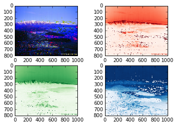
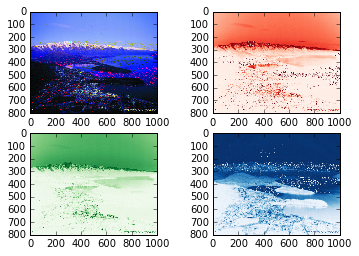

UECM3033 Assignment #2 Report
========================================================

- Prepared by: ** Hing Ming Xuan**
- Tutorial Group: T2

--------------------------------------------------------

## Task 1 --  $LU$ Factorization or SOR method

The reports, codes and supporting documents are to be uploaded to Github at: 

[https://github.com/HingMingXuan/UECM3033_assign2](https://github.com/HingMingXuan/UECM3033_assign2)

Explain your selection criteria here.

To solve the matrix, first we need to set up the condition. If the matrix is positve definite, SOR method can use to solve the matrix, else LU decomposition will be used. Matrix A is positive definite only when Matrix A can be factorised into the form LL(Transpose) which is Choleski Method. If matrix A cannot decomposed into choleski Method, then LU method is used to solve the matrix.
By using the SOR method, we need to ensure convergence of the omega must be between 0 and 2.

Explain how you implement your `task1.py` here.

To solve by LU method, function "LUdecomp" and function "LU" was defined. "LU" function solve the matrix A from Ax=b and return the value (A,b).

To solve by SOR method, we need to find the max absolute eigen value to compute the omega first by using the function "omegafind(A,D)". The formula omega = 2(1-np.sqrt(1-eig*2))/eig*2, where eig is the maximum value of eigenvalue in spectral radius. To ensure convergence, the value of omega need to be within 0 < omega < 2.Then, the iteration limit also needed to be set so that it will not loop until infinity time. In this task, the iteration limit is assumed to be 10. We start the iteration by assuming the first x is a zero vector. Then we will substitute each x we found to count the new x and iterate until the iteration limit.In order to find the exact answer, let sol equal to np.linalg.solve(A,b) else the answer will not be true.

To set the condition, if the matrix is a positive definite matrix, it can be decomposed into LL(transpose) factorisation which is Cholesky Method. Thus, we use SOR method to solve it. Else, the matrix will be solved by LU method.

Results: Both matrices solved by LU decomposition method. The first matrix given [ 1. 1. 1.] and the second matrix given [ 1. -1. 4. -3.5 7. -1. ].

---------------------------------------------------------

## Task 2 -- SVD method and image compression

Put here your picture file (image.png)

How many non zero element in $\Sigma$? 

All the three red, green and blue $\Sigma$ are non zero elements.

Put here your lower and better resolution pictures. 

Lower resolution, when n = 30

Better resolution, when n = 200

Explain how you generate these pictures from `task2.py`.

A chosen image with resolution of 1000x800 pixels is uploaded. To generate the pictures, the image need to be read in order to get the 3 matrices which is the r,g and b. Each of the r,g, and b is a 3 dimension matrix. The U,$\Sigma$ and V of the three matrices which named as Ur,Sr and Vr for the red matrix, Ug,Sg,Vg for the green matrix and Ub,Sb,Vb for the blue matrix, scipy.linalg.svd is used. Next, we find the non zero elements in $\Sigma$ by using numpy.count_nonzero. A lower resolution matrix is formed by keeping the first 30 non zero elements in $\Sigma$, and setting the other non zero elements to zero. This will construct and display a lower resolution matrix.

To display and plot the original image. First, read the “image.jpg” into img where it contain 3 matrixes, which are r,g and b. Then, compute the U,$\Sigma$ and V for for each of the red, green and blue matrices. Numpy function, count_nonzero is used to find the number of nonzero elements in $\Sigma$ for the 3 colours.  Firstly, a copy of the original $\Sigma$ to avoid loss of information by using Sr.copy and same goes to blue and green. Then only start to keep the first n non zero elements and set others to zero by using Sr1[n:800]=np.zeros_like(Sr[n:800]). Then, the Sr1 is needed to be change to dimension (800x1000) which is originally (800,1) by using sp.linalg.diagsvd so that no dimensional error will occur when combine it to a matrix of U,$\Sigma$,V by dot multiplication. So, a new matrix is created by the dot multiplication of np.dot. Then, all the process is repeated by green and blue matrices.

Finally, a new lower resolution image plotted

What is a sparse matrix?
A sparse matrix is a matrix which most of the elements are zero. Besides that, if most of the elements are nonzero, then the matrix will be considered dense.
In this assignment, sparse matrix is formed when the first 30 elements of $\Sigma$ is kept and other elements are set to zero.When the dimension of $\Sigma$ is converted to (800,1000), which is consider as a large sparse matrix, then this will create a lower resolution of pictures when it is combined with U and V by using dot multiplication. Sparse matrix was used in task 2 in order to make the lower resolution picture.

-----------------------------------

last modified: 11/3/2016
